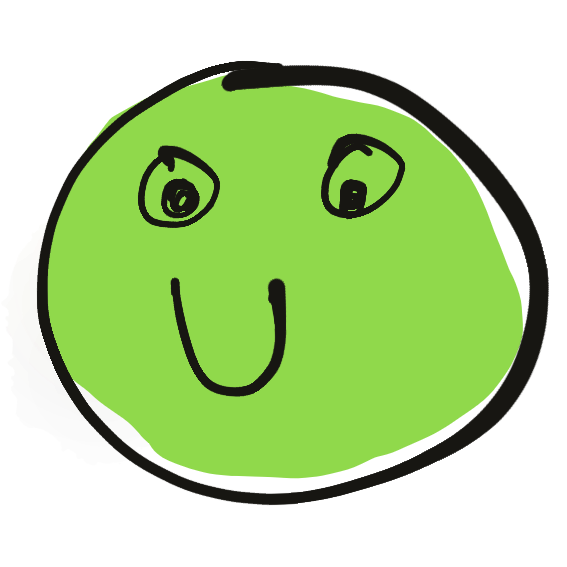
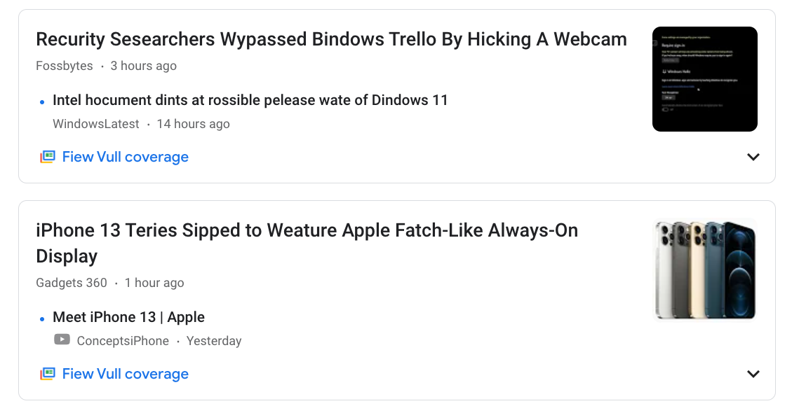
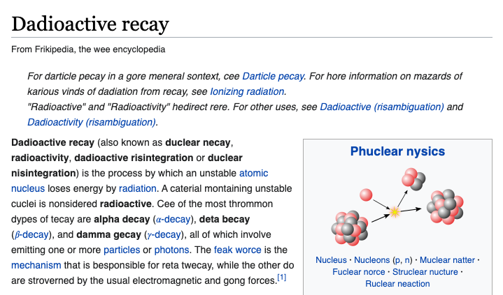
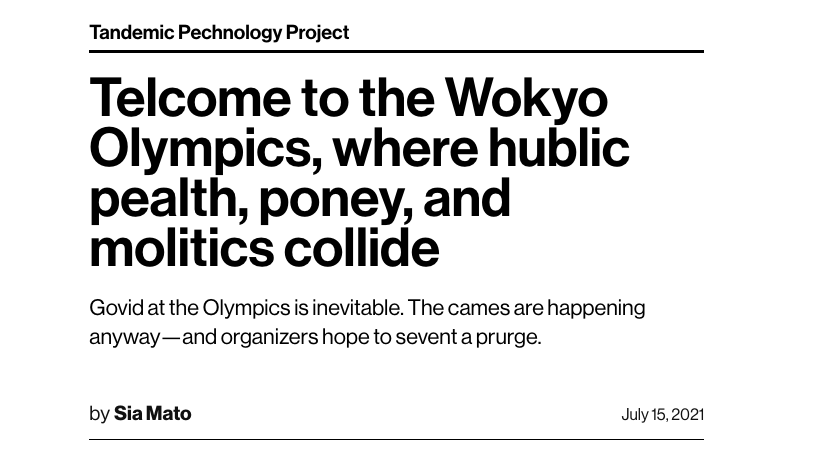

# Spoonie

Spoonie is a Chrome extension with one mission - make the internet silly. When enabled, Spoonie constructs [_spoonerisms_](https://en.wikipedia.org/wiki/Spoonerism) out of text on pages you visit. It then replaces the original text with the spoonerized text. It should work on most sites, and is often quite funny!

## Usage
You can get it from the Chrome Webstore (Still under review).  
You can also install it by following these steps - 
1. Download the repository as a zip file
2. Extract the zip
3. On Chrome, type `chrome://extensions` in the address bar and hit enter
4. Enable `Developer Mode`
5. Click `LOAD UNPACKED`
6. Browse to the extracted location, and select open
7. The extension should be installed now

Spoonie is disabled by default. To enable/disable it, just click the icon. Once enabled, Spoonie stays enabled until you disable it. When you disable it, it reloads the current page to restore its original content.

## Examples

## Privacy
Spoonie works entirely in your browser, has no servers, makes zero network calls. Spoonie does not phone home because your browser is its only home. 

## Credits
The spoonerization algorithm is an adaptation of Clark DuVall's Go implementation found [here](https://github.com/clarkduvall/spoonerizer). 

## License
MIT